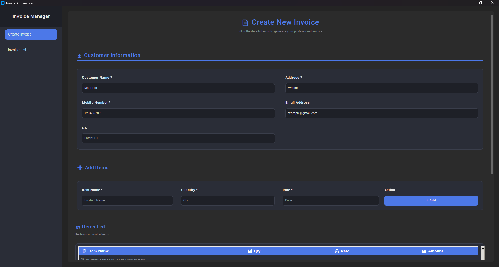
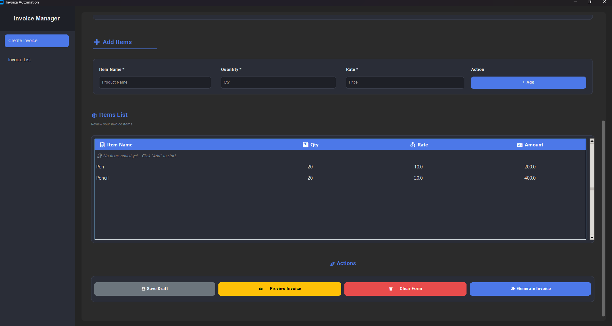
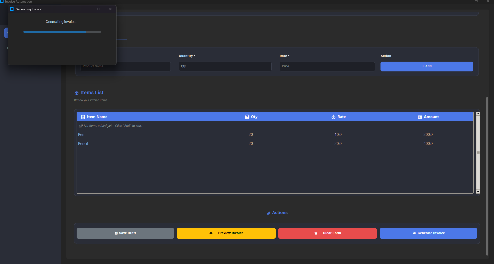
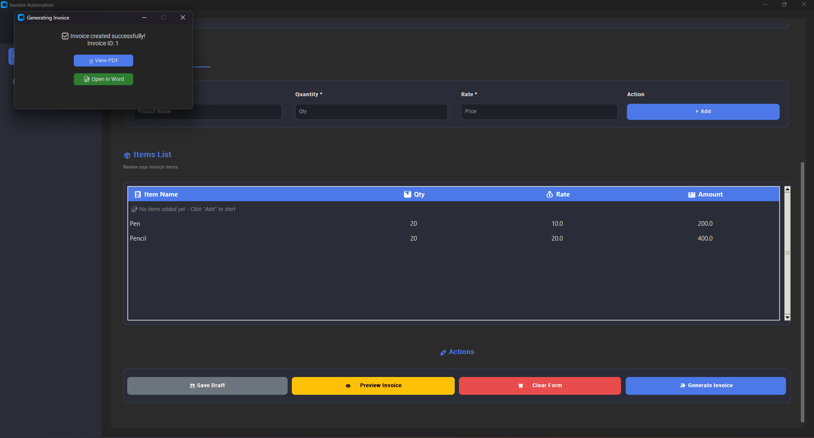
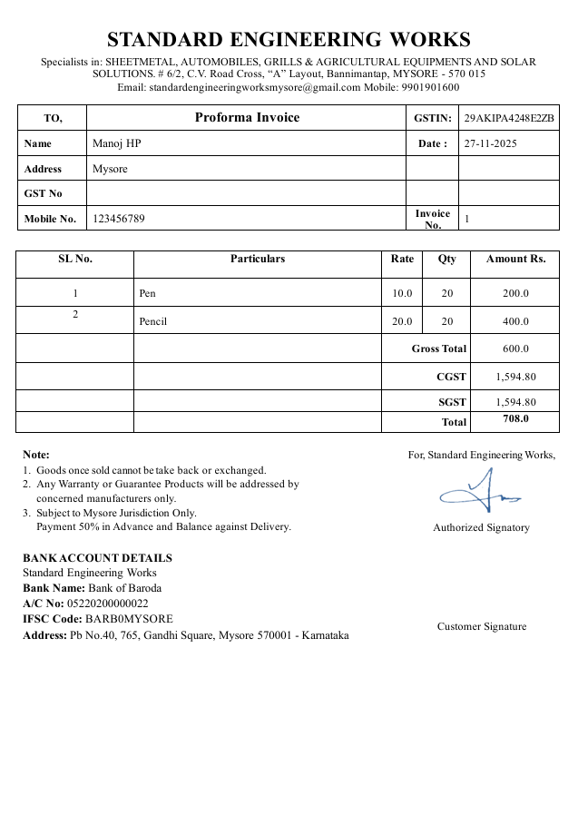

# Invoice Automation 🧾

A desktop-based Invoice Automation system built using **Python** and **CustomTkinter**, with functionality to generate PDF invoices.

---

## 🚀 Features

- Add customer and invoice details
- Store item list with quantity, rate, and amount
- Auto-generate PDF invoices using a `.docx` template
- SQLite database support (via `db_connection`)
- Modular MVC structure (controller, model, view)

---

## 📁 Project Structure

```bash
Invoice_Automation/
├── controller/ # Handles logic
├── custom_widgets/ # Custom UI components
├── data/ # Data files (if any)
├── db_connection/ # SQLite DB connection
├── invoice_template/ # Word invoice template (for PDF)
├── model/ # Data models
├── view/ # UI with CustomTkinter
├── app_config.py # Configuration
├── main.py # Entry point
├── requirements.txt # Python dependencies
```


---

## 🛠️ Installation

### 1. Clone the repository

```bash
git clone https://github.com/manojhp24/Invoice_Automation.git
cd Invoice_Automation
```

## Create and activate a virtual environment
```bash
python -m venv venv
```

Activate virtual environment
### On Windows:
venv\Scripts\activate
### On Linux/Mac:
source venv/bin/activate

### Install dependencies
```bash
pip install -r requirements.txt
```

### Run the application
```bash
python main.py
```
## 📸 Screenshots

### Customer Entry Form


### Product Entry Form


### Invoice Generating


### Invoice Generated Successfully


### Sample Invoice


